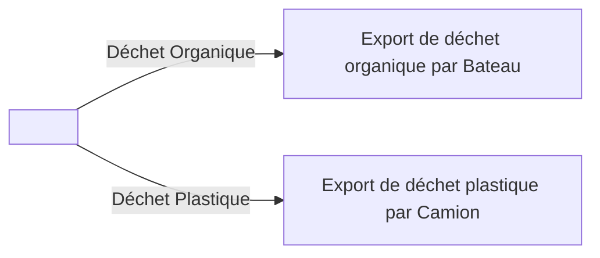
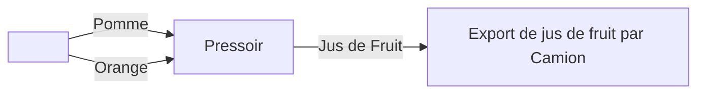

# Bien débuter sur Stingray

### Arrivée sur le serveur

Lorsque vous arrivez sur le serveur, les deux premières choses à faire sont : rejoindre le Discord et se créer une identité RP sur le site. Dans votre stuff, vous pouvez retrouver un téléphone, en le prenant en main, un HUD du téléphone apparaîtra. En bas à gauche, vous trouverez un logo de cadenas. En cliquant sur cet icone, vous aurez accès à votre mot de passe de connexion au site web. Utilisez le pour vous connecter au site web [http://binarybank.fr](http://binarybank.fr) 

### Création de votre identité RP

Lors de la première connexion sur le site, vous devrez créer votre identité RP. Les pseudos non RP, provocateurs ou déplacés sont proscrits. Ils pourront être changés par un admin dans le cas où le prénom ou le nom seront jugés inappropriés. Dans de rares cas, il sera possible de faire une demande de changement d’identité auprès du gouverneur.

Un fois votre identité créée, vous aurez accès à toutes les fonctionnalités du site, et un compte bancaire a votre nom sera alors ouvert.

### Faire de l’argent au début ? Comment ça marche wAllah j’ai besoin de moula **craquage complet de la part du rédacteur de ce Wiki**

Nous conseillons à tous les joueurs de commencer à faire les chaines de productions dites “Starter”, ne demandant aucun prérequis. Plus d’infos sur les chaines de production et leur fonctionnement ICI

Il existe actuellement 3 chaînes de production “Starter” :

- Chaine de production d’eau potable

- Chaine de traitement de déchet

- Chaine de production de Jus de Fruit

Nous ne pouvons que vous conseiller d’accéder à l’onglet wiki du site web (profil → métier → wiki). Celui-ci répertorie toutes les recettes, affiche la machine à utiliser, et où trouver ces machines.